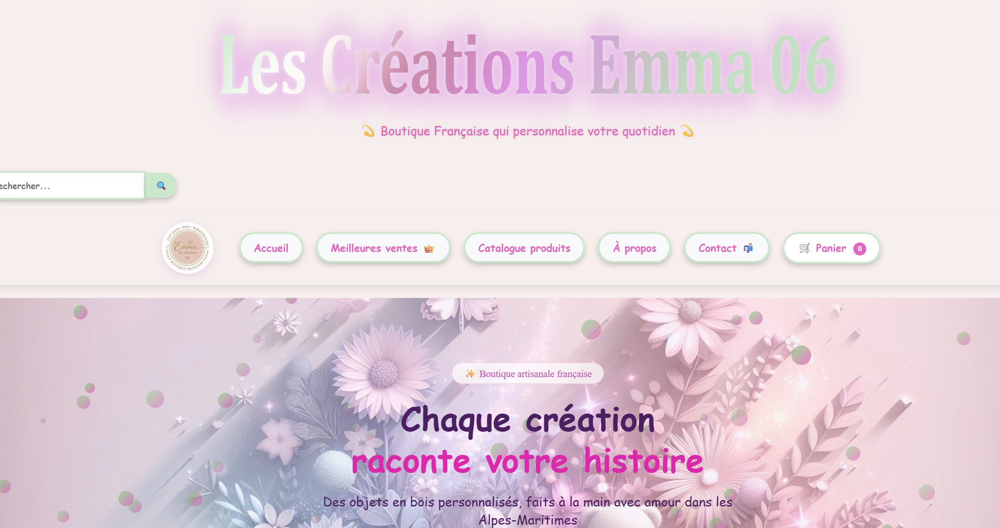
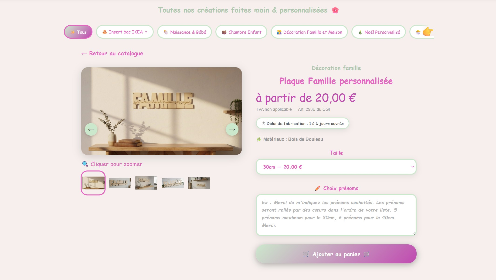
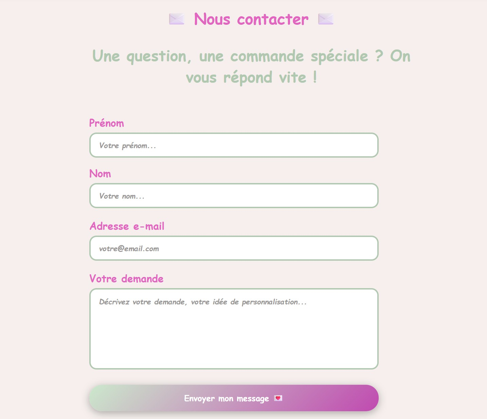
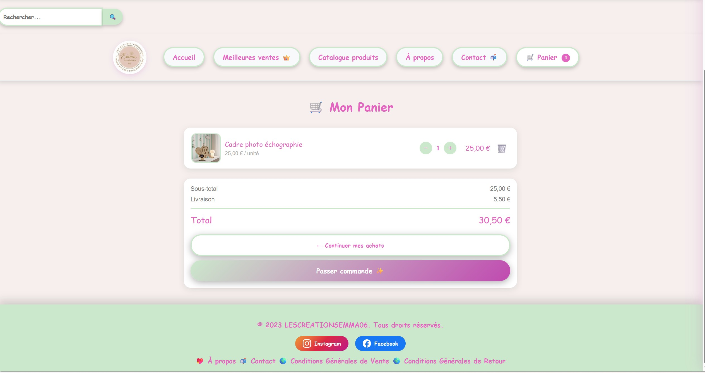

 *Projet réalisé pour mon propre site E-Commerce et dans le developpement de mes compétences*
 *But : recherche active d'alternance septembre 2026 pour demarrer ma 3éme année de licence en MIASHS et suivre avec un Master MIAGE à l'université de Nice*
 
 ## 🛒 Site E-commerce - LesCréationsEmma06

Projet de développement web visant à migrer une boutique artisanale depuis ETSY https://lescreationsemma06.etsy.com vers une solution propriétaire personnalisée.

## 🚀 À propos du projet

Ce site a été conçu pour offrir une expérience d'achat fluide et une meilleure autonomie dans la gestion des stocks et des commandes.
Il permettra aussi de ne plus passer par les frais de la plateforme ETSY.

## 🛠️ Technique
* Frontend : HTML5, CSS3, JavaScript.
* Déploiement : GitHub Pages.
* Paiement (en cours) : Intégration de l'API Stripe.
* Données (en cours) : Migration vers Firebase Firestore (NoSQL).

## 💡 Fonctionnalités principales
- Design Responsive.
- Catalogue complet avec filtrage par catégorie. ** en cours **
- Système de panier (stockage local js).
- Interface Admin pour la gestion des stocks ** en cours de développement via Firebase **

## 📈 Évolution et apprentissage
Ce projet est un "Work in Progress" qui me permet de mettre en pratique :
- La manipulation du DOM en JavaScript.
- L'intégration d'APIs tierces pour le e-commerce.
- La structuration de données pour le web.
- La POO
- l'utilisation de JavaScript, HTML et CSS

# Images site

